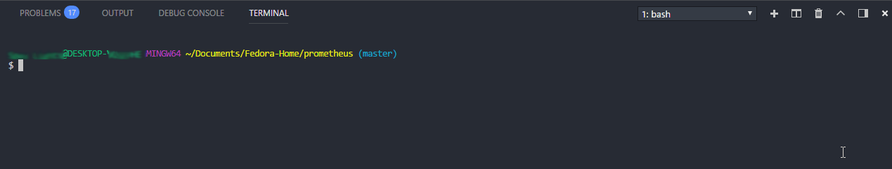

# **Basics**

## Bash shell is a type of command line interpreter or terminal emulator found in some operating systems like Unix and Linux. 

### "command line interpreters or terminal emulators" are all fancy names to mean one thing: a software that accepts commands and passes it to the computer and returns the output of those commands.  Put it in simple terms, these softwares let you talk with the computer by running keyboard commands.  Hence, these softwares are called command line interface (short: CLI). You interface (communicate) with the computer by running commands. This way of communicating with the computer is mostly used by software developers because of its efficiency and power. Average computer users use another way to talk with the computer: Graphical User Interface (short: GUI). This is the typical interface that lets you see files and folders visually, lets you cut and copy items and lets you go to your favorite movies folder and play them. I mean, you get the point, right?

## **Why we use the Bash Shell?**

- ### So why do software developers use a CLI like Bash Shell? Why not use a GUI like the ones you might have used in Windows or in Mac? The reason is, a CLI like Bash Shell makes difficult tasks possible to accomplish which would otherwise be impossible to accomplish using a GUI. For example, let's imagine you have 100 folders that are named like, Folder1, Folder2,......Folder100. Let's say, there's a file named script.sh in each of these folders. And here's the difficult task: you need to go to a folder, say, Folder1, cut the script.sh file and create a new folder inside the Folder1 folder and name it "Script1" and paste the script.sh inside the newly created folder. You need to do this for all hundred folders. Now imagine doing this simple yet boring task using a GUI. It might probably take several minutes. But with a CLI like Bash Shell, all you need to do is, run some commands and you can finish the same task in milliseconds. 

# **Experiment**

1. ### Open up Visual Studio Code. Press `ctrl + ~` to open up the integrated command line interpreter. In Windows, there's the 'Command Prompt'. In Linux, command line interpreters are called 'Terminal'. Anyway, since we want to learn bash shell on a Windows PC, we have installed `MINGW64`, a bash shell simulator for Windows. Typically, terminals show the sign `username@machinename`. So in the gif which I've blurred out a little bit, the username is "Achilles Troy" and machine name is "DESKTOP-" and some letters. Below it, you can see the dollar sign `$`. That's the Shell prompt. The bash shell is prompting you to type some commands. You can tell why in Windows they call "command line interpreter or terminal emulator" as command prompt. Because it's prompting you to type commands.  

2. ### Now enter this command `blitz` to see what happens when a command does not exist. You should get a "bash: blitz: command not found" error message. In fact, this is the error you would get if you use command names that don't exist.  Try all these commands one by one to get a feel for this type of error: `Ace` `Achilles` `Britano` `SilverLight` `Zovial` `Daredevil` `Troy`. All these commands should give you the same error message. To finish things off, try your own command names that give this error. It could be any command name like `jdwijd`.

3. ### Now let's try some commands that work. Try: `date` to get the current date and time, `df` to see your system's free space information, `df -h` to get the same free space information in a more human friendly way. Also, watch out for the space, it should be `df -h`, not `df-h`. 

# **Command Line Jargons** (technical terms)

## **File System Tree or Directory Tree**

- ### In Unix and Linux environments, everything is a file. The concept of hard drives are present but not given the same priority as in Windows where information is organized based on partitions such as C:drive, D:drive. Every file you might've accessed in Windows started from a partition such as C: or D: or any other letter you have given the partition. 

- ### In Linux though, the folders (in Linux, we don't say folders we say directories) start from a root directory and the **file system tree** progresses sort of forming a parent-child relationship. By saying a parent-child relationship, we mean a dependency that says you can get a child only from a parent and not the other way around. For example, to access a directory named "Images", you have to go to the root directory symbolically represented as `/`. And then, only then you can access the child directory `Images`. The **directory tree** in this case would be `/Images`. So couple things you need to takeaway from all this is that, every directory starts with the root directory `/`. The root directory in turn contains files and subdirectories, which in turn contains more files and more subdirectories and so on and so forth. 

## **Current Working Directory**

- ### **Current working directory** is the current directory that is being worked by the computer's RAM. So when you play a mp4 file named "Cool" inside the movies directory that's in your root directory. You are working the "Cool" movie with your RAM. The **current working directory** in this case is the directory with the **directory tree** `/movies`. If you didn't expend work with your RAM, you wouldn't have found the "Cool.mp4" file inside the movies directory.

- ### Let's say, you changed your mind and you wanted to watch a action movie in the action directory found in the root directory. When you change into the action directory, the **current working directory** is the action directory and the `directory tree` is `/action`.

- ### Cruical things to takeaway, **current working directory** changes as you shift your focus across your directories. If you don't make the directory you want to work on as your **current working directory**, you would simply fail to accomplish the task you want to carry out. So with the above example, you can't play the movies from the root directory. Because when you make the root directory your **current working directory**, you would see two directories `/movies` and `/action`, not `/action/action_movie.mp4`.  

## **Reference**

[The Linux Command Line]()

Source: Prometheus-books/Shell/The_Linux_Command_Line